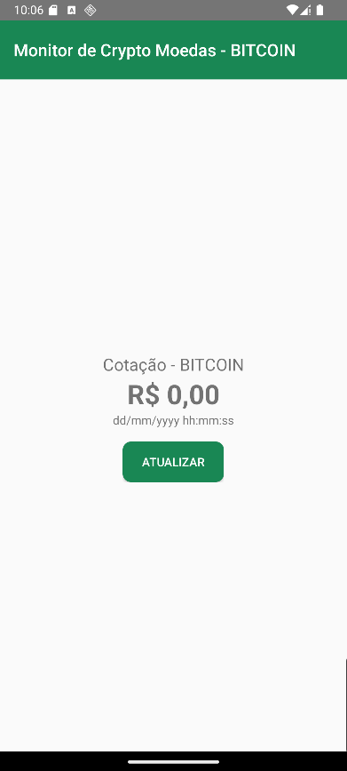
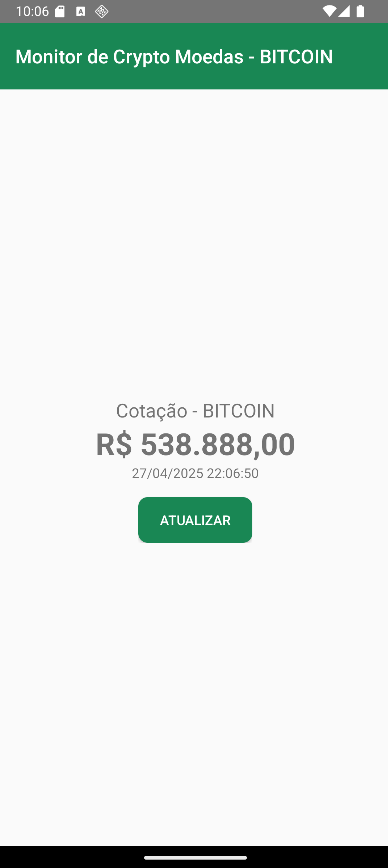

# Android Crypto Monitor
Este projeto Android em Kotlin consome a API do MercadoBitcoin para exibir o valor e a data da última cotação do Bitcoin.


## Descrição Geral
Uma aplicação simples que utiliza **Coroutines** e **Retrofit2** (com conversor Gson) para realizar requisições assíncronas ao endpoint `/api/BTC/ticker/` do [MercadoBitcoin.net](https://www.mercadobitcoin.net/). Exibe na interface o preço formatado em reais e a data/hora da atualização.

## Ferramentas e Dependências
- **Linguagem:** Kotlin
- **Build:** Gradle
- **Bibliotecas:**
    - kotlinx-coroutines
    - Retrofit2
    - Retrofit2 Gson Converter

## Estrutura de Pacotes
```text
src/main/java/scima/com/github/aula3103/
├── model/
│   └── TickerResponse.kt
├── service/
│   ├── MercadoBitcoinService.kt
│   └── MercadoBitcoinServiceFactory.kt
└── MainActivity.kt
```

## Componentes Principais

### 1. TickerResponse.kt
Representa o envelope retornado pela API:

```kotlin
class TickerResponse(val ticker: Ticker)

class Ticker(
    val high: String,
    val low: String,
    val vol: String,
    val last: String,
    val buy: String,
    val sell: String,
    val date: Long
)
```
- **TickerResponse:** encapsula o objeto `Ticker`.
- **Ticker:** armazena valores como `high`, `low` e `last` (todos em `String`), além de `date` em timestamp Unix.
---
### 2. MercadoBitcoinServiceFactory.kt
Configura e fornece instância do Retrofit:

```kotlin
fun create(): MercadoBitcoinService {
    val retrofit = Retrofit.Builder()
        .baseUrl("https://www.mercadobitcoin.net/")
        .addConverterFactory(GsonConverterFactory.create())
        .build()

    return retrofit.create(MercadoBitcoinService::class.java)
}
```
- Define a URL-base da API.
- Adiciona conversor Gson para desserializar JSON.
---
### 3. MercadoBitcoinService.kt
Declara o endpoint de ticker:

```kotlin
interface MercadoBitcoinService {
    @GET("api/BTC/ticker/")
    suspend fun getTicker(): Response<TickerResponse>
}
```
- Método `suspend` usado com Coroutines para chamadas não bloqueantes.
- Retorna `Response<TickerResponse>` para tratar sucesso e falhas.
---
### 4. MainActivity.kt
Controla a interface e lógica de rede:

```kotlin
btnRefresh.setOnClickListener {
    makeRestCall()
}

private fun makeRestCall() {
    CoroutineScope(Dispatchers.Main).launch {
        val service = MercadoBitcoinServiceFactory().create()
        val response = service.getTicker()

        if (response.isSuccessful) {
            val ticker = response.body()?.ticker
            // Formata valor em reais
            val lastValue = ticker?.last?.toDoubleOrNull()
            lblValue.text = NumberFormat
                .getCurrencyInstance(Locale("pt","BR"))
                .format(lastValue)

            // Converte timestamp em data legível
            val date = Date((ticker?.date ?: 0L) * 1000)
            lblDate.text = SimpleDateFormat(
                "dd/MM/yyyy HH:mm:ss",
                Locale.getDefault()
            ).format(date)
        } else {
            // Tratamento de erros HTTP
        }
    }
}
```
- Atualiza `TextView` com preço e horário.
- Lida com código de resposta e exceções, exibindo `Toast` em caso de falha.

## Evidências de Execução



> A captura acima demonstra a interface antes da execução e após a execução, exibindo o valor formatado em reais e o timestamp convertido corretamente.


